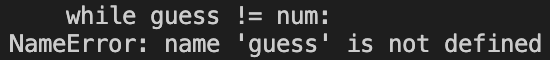
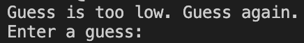
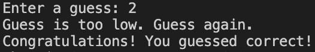
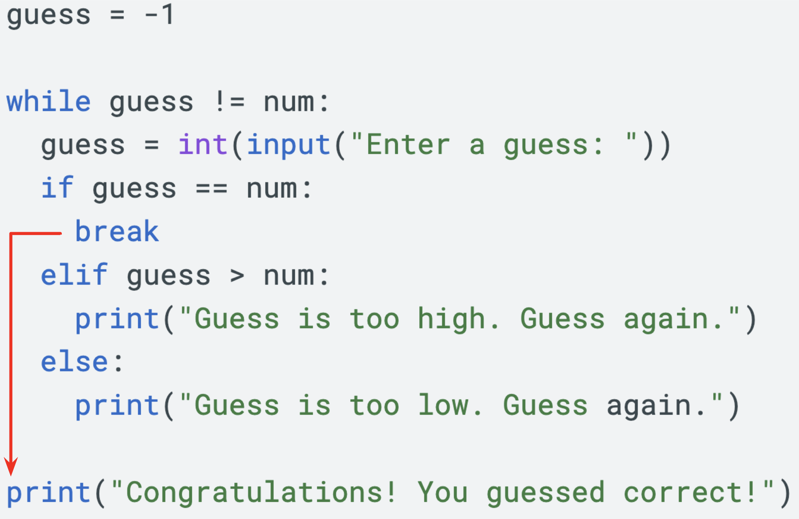
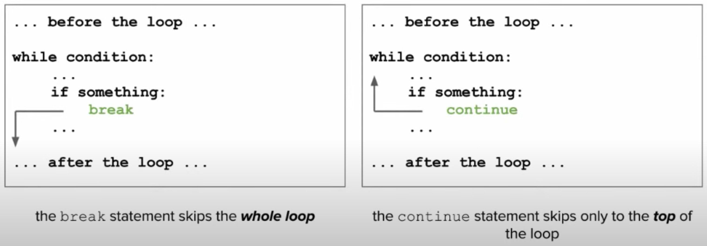
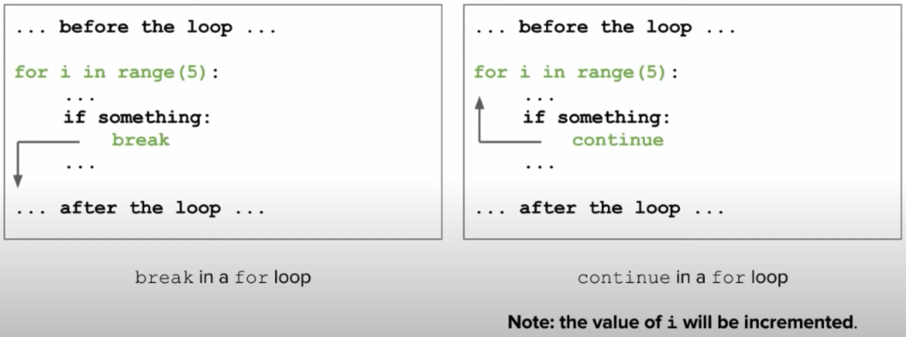

# 5.7 Break and Continue
Sometimes checking the condition after the entire `while` loop runs isn't the most effective strategy. What if we wanted to go back to the beginning of the loop while we're in the middle of it? Or if we wanted to stop a loop if a certain condition occurred? This is where `break` and `continue` come in handy.

## Break
To better understand what `break` does, let's take a loop at the guessing game program we created from the previous Lesson. Here is a reminder of what that looked like:
```python
1   import random
2
3   # Generate a random number between 1 and 100
4   num = random.randrange(1, 101)
5
6   # Ask user for their first guess
7   guess = int(input("Enter a guess: "))
8
9   # If user guess wrong, give info about their guess and prompt again
10   while guess != num:
11     if guess > num:
12       print("Guess is too high. Guess again.")
13     else:
14       print("Guess is too low. Guess again.")
15    
16     guess = int(input("Enter a guess: "))
17
18  # Output message for when they guess correct.
19  print("Congratulations! You guessed correct!")
```
<span style="color:orangered">
<b>Notice that <code>Line 7</code> and <code>Line 16</code> we are repeating code. We are repeating it once outside the loop and another time inside the loop. Repeating code is generally bad and should be avoided.</b> So how do we rewrite this program with only one copy of this line?
</span>

### Attempt #1: Remove the input on `Line 7`
- But now, we have an error because the variable guess does not exist before we use it in `Line 10`


### Attempt #2: Set guess to any number outside of 1 to 100
```python
guess = -1

while guess != num:
  if guess > num:
    print("Guess is too high. Guess again.")
  else:
    print("Guess is too low. Guess again.")
```

Because the `if` statements come first, it'll see that guess is less than num and print `Guess is too low. Guess again.`:



### Attempt #3: Switch the prompt with the `if` statements
```python
guess = -1

while guess != num:
  guess = int(input("Enter a guess: "))
  if guess > num:
    print("Guess is too high. Guess again.")
  else:
    print("Guess is too low. Guess again.")
```

This seems all good but if we test it, the output will still tell use if the number is too high or too low before telling us Congratulations:


### ALMOST Correct Attempt: Add another condition to check if `guess == num`
So here, we've changed up the the `if` statements to include when `guess == num` in the `else` statement. But what should be put in the body of this `else` statement?

```python
guess = -1

while guess != num:
  guess = int(input("Enter a guess: "))
  if guess == num:
    ???
  elif guess > num:
    print("Guess is too high. Guess again.")
  else:
    print("Guess is too low. Guess again.")
```

<span style="color:orangered">
<b>This is where <code>break</code> comes in handy:</b>
</span>

```python
guess = -1

while guess != num:
  guess = int(input("Enter a guess: "))
  if guess == num:
    break
  elif guess > num:
    print("Guess is too high. Guess again.")
  else:
    print("Guess is too low. Guess again.")
```

<span style="color:orangered">
<b>Here is what's happening when the code reaches <code>break</code>:</b>
</span>



<span style="color:orangered">
<b>Once the program reaches <code>break</code> inside the while loop, it tells Python to "break" out of the while loop and continue the code AFTER the loop.</b>
</span>

### CORRECT Attempt: Remove the `guess = -1` and change the condition:
We don't actually need to initialize a value for `guess` before the loop. Instead, let's remove it, but once it gets removed the condition of the while loop will run into an error. Then, we can change the condition to be the boolean value `True`. Since it'll always be `True`, the loop will always run. Usually this is bad since it will cause an **infinite loop**. However, making use of `break` allows us to break out of the loop when we need to.

```python
while True:
  guess = int(input("Enter a guess: "))
  if guess == num:
    break
  elif guess > num:
    print("Guess is too high. Guess again.")
  else:
    print("Guess is too low. Guess again.")
```

## Continue
<span style="color:deeppink">
<b>The <ins><code>continue</code></ins> statement skips to the <ins>top of the loop</ins>:</b>
</span>



<span style="color:red">
<b>NOTE: Both <code>break</code> and <code>continue</code> can be used inside <code>while</code> AND <code>for</code> loops</b>
</span>



## Example #1: Basic While Loop with `break`
Take a look at the code below, what do you think will be the output of this program?

```python
n = 5
while n > 0:
  if n == 2:
    break
  print(n)
  n -= 1
print('Loop is finished.')
```

```Answer goes here:

```

## Example #2: Basic While Loop with `continue`
Now, let's change the `break` in the previous example to `continue`. What happens?

```python
n = 5
while n > 0:
  if n == 2:
    continue
  print(n)
  n -= 1
print('Loop is finished.')
```

```Answer goes here:

```

## Example #3: Bike Frame Size
The following program will ask the user for the frame size of their bike and tell them if it's too big, too small, or the corrrect size. What can we do to have the program continuously prompt the user to enter a size until it's the correct size?

```python
size = int(input("Enter the frame size (cm): "))

if size > 60:
  print("The bike is too big!!")
elif size < 55:
  print("The bike is too small!")
else:
  print("The bike is the correct size.")
```

>**Answer:**
```python

```